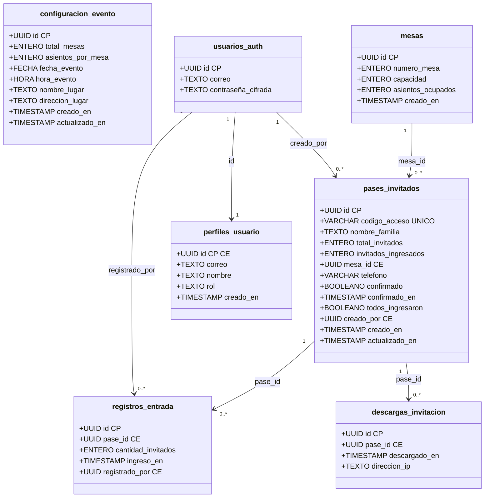
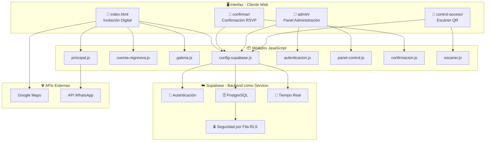
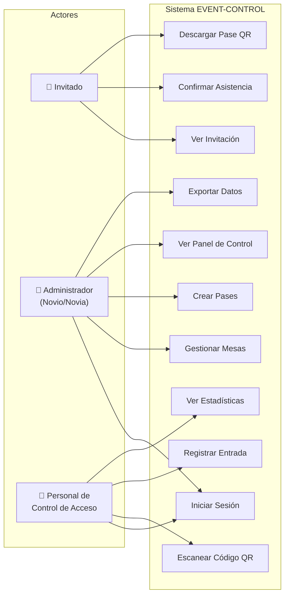
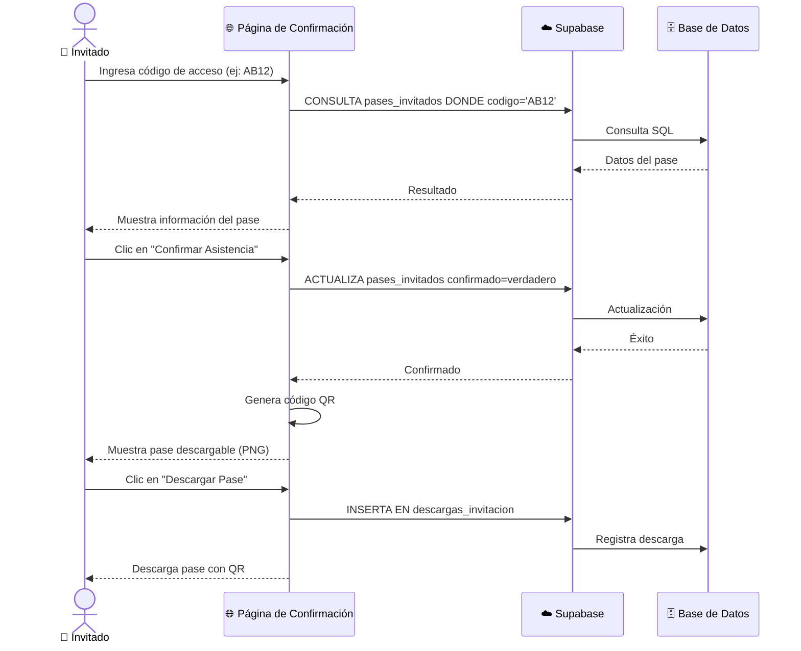

# 📋 DOCUMENTACIÓN TÉCNICA DEL PROYECTO
## Sistema de Control de Eventos - EVENT-CONTROL

**Repositorio:** https://github.com/rafaelrav8770/EVENT-CONTROL  
**Fecha de Creación:** 6 de Febrero de 2026  
**Versión:** 1.0.0

---

## 📌 1. DESCRIPCIÓN DEL PROYECTO

Sistema web completo para la **gestión de invitaciones y control de acceso** a eventos (bodas, fiestas, conferencias). Permite:

- ✅ Invitación digital personalizada con cuenta regresiva
- ✅ Generación de pases con códigos QR únicos
- ✅ Confirmación de asistencia en línea
- ✅ Panel de administración para gestión de invitados
- ✅ Control de acceso en tiempo real con escaneo QR
- ✅ Monitoreo en vivo de entradas al evento

---

## 🏗️ 2. ARQUITECTURA DEL SISTEMA

```
┌─────────────────────────────────────────────────────────────────┐
│                        FRONTEND (Cliente)                        │
├─────────────┬─────────────┬──────────────┬─────────────────────┤
│  index.html │ confirm/    │   admin/     │   access-control/   │
│  Invitación │ Confirmación│   Dashboard  │   Escáner QR        │
└──────┬──────┴──────┬──────┴──────┬───────┴──────────┬──────────┘
       │             │             │                  │
       └─────────────┴─────────────┴──────────────────┘
                              │
                    ┌─────────▼─────────┐
                    │   Supabase SDK    │
                    │   (JavaScript)    │
                    └─────────┬─────────┘
                              │
              ┌───────────────▼───────────────┐
              │         SUPABASE (BaaS)       │
              ├───────────────────────────────┤
              │  • PostgreSQL Database        │
              │  • Authentication (Auth)      │
              │  • Row Level Security (RLS)   │
              │  • Realtime Subscriptions     │
              └───────────────────────────────┘
```

---

## 🛠️ 3. TECNOLOGÍAS UTILIZADAS

### Frontend
| Tecnología | Versión | Uso |
|------------|---------|-----|
| **HTML5** | - | Estructura de páginas |
| **CSS3** | - | Estilos y animaciones |
| **JavaScript ES6+** | - | Lógica del cliente |
| **Google Fonts** | - | Tipografías (Cormorant Garamond, Great Vibes, Montserrat) |

### Backend (BaaS)
| Tecnología | Versión | Uso |
|------------|---------|-----|
| **Supabase** | 2.39.0 | Backend as a Service |
| **PostgreSQL** | 15+ | Base de datos relacional |
| **Supabase Auth** | - | Autenticación de usuarios |
| **Supabase Realtime** | - | Actualizaciones en tiempo real |

### Herramientas
| Herramienta | Uso |
|-------------|-----|
| **Git** | Control de versiones |
| **GitHub** | Repositorio remoto |
| **Python http.server** | Servidor de desarrollo local |

---

## 📁 4. ESTRUCTURA DE ARCHIVOS

```
EVENT-CONTROL/
│
├── 📄 index.html                    # Página principal de invitación
├── 📄 config.json                   # Configuración del evento
├── 📄 package.json                  # Dependencias del proyecto
│
├── 📁 css/
│   └── styles.css                   # Estilos globales
│
├── 📁 js/
│   ├── main.js                      # Script principal
│   ├── countdown.js                 # Cuenta regresiva
│   ├── gallery.js                   # Galería de fotos
│   └── supabase-config.js           # Configuración Supabase
│
├── 📁 admin/                        # Panel de administración
│   ├── index.html                   # Login admin
│   ├── dashboard.html               # Panel de control
│   ├── css/admin.css                # Estilos admin
│   └── js/
│       ├── auth.js                  # Autenticación
│       └── dashboard.js             # Lógica del dashboard
│
├── 📁 confirm/                      # Confirmación de asistencia
│   ├── index.html                   # Página de confirmación
│   ├── css/confirm.css              # Estilos
│   └── js/confirm.js                # Lógica de confirmación
│
├── 📁 access-control/               # Control de acceso
│   ├── index.html                   # Página principal
│   ├── scanner.html                 # Escáner QR
│   ├── css/access.css               # Estilos
│   └── js/scanner.js                # Lógica del escáner
│
├── 📁 api/
│   └── keep-alive.js                # Script keep-alive
│
├── 📁 scripts/
│   └── test-keep-alive.js           # Test de keep-alive
│
└── 📁 SQL/                          # Scripts de base de datos
    ├── crear-base-datos.sql         # Creación de tablas
    ├── supabase-rls-policies.sql    # Políticas RLS
    ├── sql-mesas-variables.sql      # Configuración de mesas
    ├── corregir-politicas-rls.sql   # Correcciones RLS
    ├── fix-login-rapido.sql         # Fix de login
    └── verificar-usuarios.sql       # Verificación usuarios
```

---

## 🗄️ 5. MODELO DE BASE DE DATOS (UML)

### 5.1 Diagrama de Clases (Entidades de la Base de Datos)



> **Leyenda:** CP = Clave Primaria | CE = Clave Extranjera | UNICO = Restricción de unicidad

### 5.2 Diagrama de Componentes (Arquitectura)



### 5.3 Diagrama de Casos de Uso



### 5.4 Diagrama de Secuencia - Flujo de Confirmación



### Tablas Principales

| Tabla | Descripción | Campos Clave |
|-------|-------------|--------------|
| `configuracion_evento` | Configuración del evento | fecha, hora, ubicación |
| `mesas` | Mesas del evento | número, capacidad, ocupados |
| `pases_invitados` | Pases de invitados | código, familia, confirmación |
| `registros_entrada` | Registros de entrada | pase, cantidad, hora |
| `perfiles_usuario` | Perfiles de administradores | rol (novio/novia/acceso) |
| `descargas_invitacion` | Estadísticas de descargas | pase, fecha, IP |

---

## 🔐 6. SEGURIDAD (Row Level Security)

El sistema implementa **políticas RLS** en PostgreSQL:

```sql
-- Lectura pública para invitados
CREATE POLICY "public_read" ON guest_passes 
  FOR SELECT TO anon USING (true);

-- Solo autenticados pueden crear pases
CREATE POLICY "auth_insert" ON guest_passes 
  FOR INSERT TO authenticated WITH CHECK (true);

-- Usuarios solo ven su propio perfil
CREATE POLICY "own_profile" ON user_profiles 
  FOR SELECT TO authenticated USING (auth.uid() = id);
```

### Roles del Sistema

| Rol | Permisos |
|-----|----------|
| `anon` | Ver invitación, confirmar asistencia |
| `groom` | Crear pases, ver dashboard completo |
| `bride` | Crear pases, ver dashboard completo |
| `access_control` | Escanear QR, registrar entradas |

---

## 🚀 7. FLUJO DE FUNCIONAMIENTO

### 7.1 Flujo del Invitado

```
1. Invitado recibe enlace → index.html
         ↓
2. Ve invitación animada con cuenta regresiva
         ↓
3. Click "Confirmar Asistencia" → confirm/
         ↓
4. Ingresa código de 4 dígitos (ej: AB12)
         ↓
5. Sistema valida código en guest_passes
         ↓
6. Confirma asistencia (confirmed = true)
         ↓
7. Descarga pase con código QR (PNG)
```

### 7.2 Flujo del Administrador

```
1. Accede a admin/ → Login con email/password
         ↓
2. Supabase Auth valida credenciales
         ↓
3. Carga dashboard.html
         ↓
4. Puede:
   • Crear mesas (tables)
   • Generar pases (guest_passes)
   • Ver estadísticas en tiempo real
   • Monitorear confirmaciones
```

### 7.3 Flujo de Control de Acceso

```
1. Personal accede a access-control/
         ↓
2. Login con rol "access_control"
         ↓
3. Escanea código QR del invitado
         ↓
4. Sistema busca pase por access_code
         ↓
5. Valida pase y registra entrada en entry_logs
         ↓
6. Actualiza guests_entered en guest_passes
```

---

## 📊 8. FUNCIONALIDADES PRINCIPALES

### 8.1 Página de Invitación (index.html)
- ✅ Pantalla de entrada con animación
- ✅ Sección Hero con nombres de novios
- ✅ Cuenta regresiva al evento
- ✅ Información de padres
- ✅ Detalles del evento (fecha, hora, lugar)
- ✅ Mapa con ubicación
- ✅ Itinerario del evento
- ✅ Galería de fotos
- ✅ Sección de confirmación

### 8.2 Panel de Administración (admin/)
- ✅ Autenticación segura
- ✅ Dashboard con estadísticas
- ✅ Gestión de mesas (CRUD)
- ✅ Generación de pases con códigos únicos
- ✅ Filtros por creador (novio/novia)
- ✅ Búsqueda de invitados
- ✅ Monitor en tiempo real
- ✅ Exportación de datos

### 8.3 Confirmación (confirm/)
- ✅ Validación de código de acceso
- ✅ Mostrar información del pase
- ✅ Confirmación de asistencia
- ✅ Generación de pase QR descargable

### 8.4 Control de Acceso (access-control/)
- ✅ Escáner de códigos QR
- ✅ Búsqueda manual por código
- ✅ Registro de entradas
- ✅ Estadísticas de asistencia

---

## 🔧 9. CONFIGURACIÓN E INSTALACIÓN

### Requisitos Previos
- Python 3.x (para servidor local)
- Cuenta en Supabase (gratis)
- Navegador web moderno

### Pasos de Instalación

```bash
# 1. Clonar repositorio
git clone https://github.com/rafaelrav8770/EVENT-CONTROL.git
cd EVENT-CONTROL

# 2. Configurar Supabase
# - Crear proyecto en supabase.com
# - Ejecutar SQL de crear-base-datos.sql
# - Copiar URL y ANON_KEY

# 3. Actualizar configuración
# Editar js/supabase-config.js con tus credenciales

# 4. Ejecutar servidor local
python -m http.server 8000

# 5. Abrir en navegador
# http://localhost:8000
```

---

## 📈 10. INTEGRACIONES

### 10.1 Supabase (Backend as a Service)
- **URL:** https://xethjgzynlkrwsirrzsf.supabase.co
- **Servicios usados:**
  - PostgreSQL Database
  - Authentication
  - Realtime Subscriptions
  - Row Level Security

### 10.2 APIs Externas
- **Google Maps:** Ubicación del evento
- **WhatsApp API:** Confirmación por mensaje

---

## 📝 11. VERSIONADO

| Versión | Fecha | Cambios |
|---------|-------|---------|
| 1.0.0 | 06/02/2026 | Versión inicial completa |

---

## 👥 12. CRÉDITOS

**Desarrollador:** Rafael  
**Tecnología:** HTML5, CSS3, JavaScript, Supabase  
**Repositorio:** https://github.com/rafaelrav8770/EVENT-CONTROL

---

## 📞 13. SOPORTE

Para dudas o soporte técnico, contactar al desarrollador.

---

*Documentación generada para defensa de proyecto - Febrero 2026*
